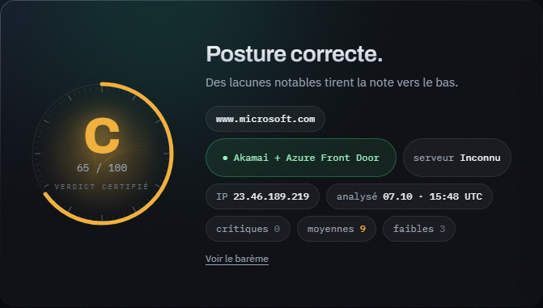
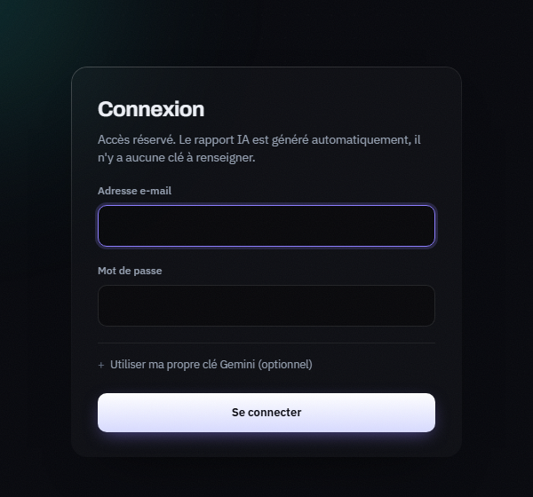
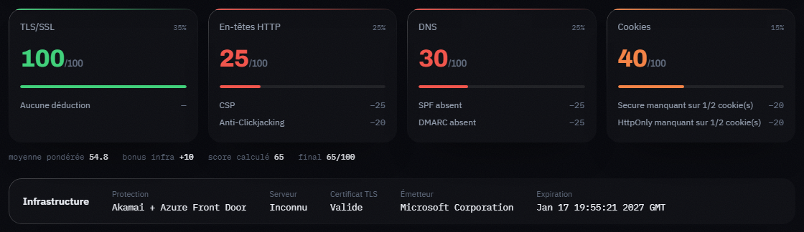
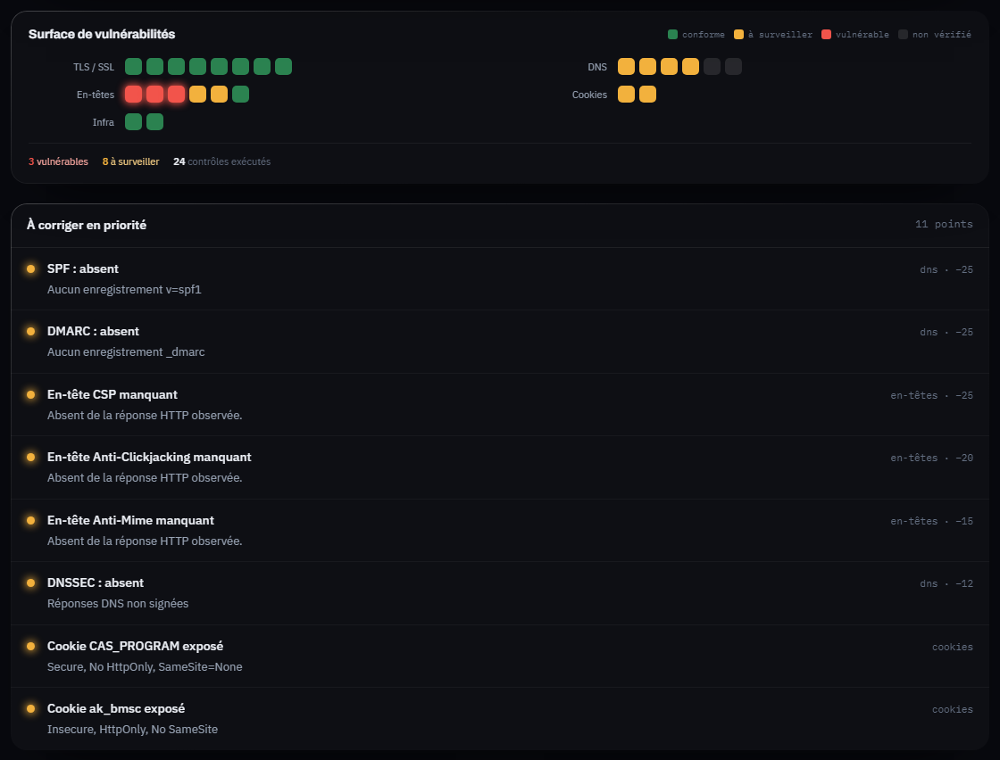
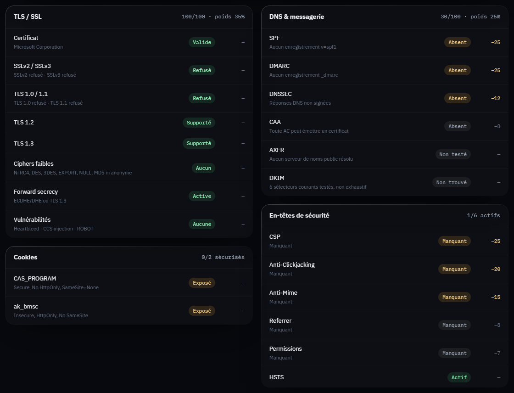

# SecuScope

> Audit de posture de sécurité externe d'un domaine : TLS, DNS, en-têtes HTTP, cookies et WAF/CDN, notés sur 100 avec un grade A–F et un rapport de risque rédigé par un LLM.


SecuScope observe ce qu'un domaine expose publiquement (handshake TLS, enregistrements DNS, réponse HTTP, cookies) et en tire une note défendable, expliquée ligne par ligne. L'audit est **non intrusif** : aucune exploitation, aucune tentative d'intrusion. Il émet quelques sondes actives légères, listées plus bas.

---

## Démo

**Démo en ligne : <https://REMPLACER-PAR-L-URL-DE-LA-DEMO>**

Identifiants de démo : *à renseigner après création du compte (`flask create-user`).*

L'accès est protégé par un compte : il n'y a pas d'inscription publique.

| | |
|---|---|
|  |  |







---

## Ce que SecuScope analyse

| Domaine | Contrôles |
|---|---|
| **TLS approfondi** (sslyze) | Versions acceptées (SSLv2/3, TLS 1.0 à 1.3), cipher suites faibles ou cassées (RC4, DES, 3DES, EXPORT, NULL, MD5, anonymes), forward secrecy, Heartbleed, CCS injection, ROBOT, validité et chaîne du certificat |
| **DNS et messagerie** | SPF (y compris `+all`), DMARC (politique), DKIM (sélecteurs courants, indicatif), DNSSEC, CAA, transfert de zone AXFR |
| **En-têtes HTTP** | CSP, HSTS, anti-clickjacking, X-Content-Type-Options, Referrer-Policy, Permissions-Policy |
| **Cookies** | `Secure`, `HttpOnly`, `SameSite` sur chaque cookie posé |
| **Infrastructure** | Toutes les couches WAF/CDN réellement détectées, dédoublonnées par fournisseur (ex. « Akamai + Azure Front Door »). Preuves acceptées, par ordre : marqueurs passifs lus dans la réponse (`Server: gws`/`ESF`, `cf-ray`, `x-akamai-*`, `x-amz-cf-id`, valeurs `Server`/`Via`, cookies à préfixe comme `visid_incap_*`), puis CNAME du domaine, de l'hôte final et de sa chaîne vers un CDN ; wafw00f seulement si aucun vrai WAF/CDN n'a été trouvé, borné à 12 s. Un cache, un routeur de plateforme ou un répartiteur de charge (Varnish, Heroku, Shopify, ELB) est affiché sans bonus. L'émetteur du certificat, le PTR, les serveurs de noms et les noms de vendeur dans le corps de page ne comptent pas. Sans preuve : « Non détecté ». |
| **Rapport IA** | Résumé exécutif, points techniques et estimation de protection sur 5 axes (MITM, XSS, clickjacking, sniffing, WAF), générés par Gemini à partir des constats |

**Économie du quota IA.** Chaque scan crée toujours une ligne d'historique (la courbe d'évolution continue de se remplir), mais le texte IA n'est régénéré que si la posture a changé. On calcule une signature de la posture (domaine, score, notes et déductions par catégorie, couches WAF/CDN, mode d'échec) ; si un audit du même domaine datant de moins de 7 jours a la même signature et un rapport valide, ce rapport est réutilisé sans appeler Gemini. Un rapport en échec n'est jamais mis en cache. Un domaine rescanné par la même session en moins de 10 minutes affiche le scan existant, avec un lien « Forcer un nouveau scan ».

Un contrôle qui n'a pas pu être vérifié (timeout, analyse partielle, réponse HTTP non lue) **ne déduit aucun point** et s'affiche comme « indéterminé » ou « non vérifiable » : on observe, on ne suppose jamais. Aucune valeur n'est inventée : serveur, émetteur et stack sont ceux lus dans la réponse, ou « Inconnu ». Quand une catégorie n'a pas pu être lue, le verdict est marqué « partiel » avec un badge « Analyse incomplète ».

---

## Notation

Le scoring v2 est inspiré de SSL Labs : quatre catégories notées sur 100, une moyenne pondérée et un **plafonnement par faille grave**.

| Catégorie | Poids |
|---|:---:|
| TLS / SSL | 35 % |
| En-têtes HTTP | 25 % |
| DNS | 25 % |
| Cookies | 15 % |

- Chaque catégorie part de 100 et déduit des points par problème observé.
- Un bonus infrastructure ajoute +5 par couche WAF/CDN distincte et réellement identifiée, +10 au maximum, avant les plafonds. Pas de WAF prouvé, pas de bonus ; un cache ou un répartiteur de charge n'en donne pas, même à côté d'un vrai WAF.
- Une faille grave plafonne le score final, quoi qu'en disent les autres catégories : HTTP en clair ou handshake TLS échoué (20), certificat invalide (59), SSLv2/SSLv3 accepté (79), cipher cassé accepté (79), AXFR ouvert (79).
- Une catégorie qui n'a pas pu être mesurée est affichée « non évaluée » et sort de la moyenne ; elle n'affiche jamais un faux 100.
- Grades : A ≥ 90, B 80–89, C 60–79, D 40–59, F < 40.

Le détail complet (déductions, plafonds, formule d'agrégation) est dans [`docs/SCORING_V2_SPEC.md`](docs/SCORING_V2_SPEC.md).

---

## Éthique et périmètre

> **N'utilisez SecuScope que sur des domaines dont vous êtes propriétaire ou pour lesquels vous disposez d'une autorisation écrite.**

- **Non intrusif** : aucune exploitation de vulnérabilité, aucun brute force, aucune charge.
- **Sondes actives légères, assumées** : ce n'est pas un outil 100 % passif. Il établit des connexions TLS (sslyze énumère les versions et suites acceptées), tente un transfert de zone AXFR auprès des serveurs de noms, lance wafw00f (quelques requêtes HTTP non destructives) uniquement en dernier recours, quand les marqueurs passifs n'ont identifié aucun WAF/CDN, et requête les enregistrements DNS. Ces requêtes restent visibles dans les journaux de la cible et peuvent déclencher des alertes.
- **Redirections** : les redirections HTTP (301/302/303/307/308, 5 sauts maximum) sont suivies à la main, et les contrôles de sécurité portent sur la réponse finale. Chaque saut est revalidé : une redirection vers une adresse non publique n'est jamais suivie.
- **Anti-SSRF** : seules les adresses IP publiques sont analysées. Toute résolution vers une adresse privée, de bouclage, link-local, multicast, réservée ou non spécifiée est rejetée, et l'analyse TLS vise l'IP déjà validée, jamais le nom (pas de rebinding DNS).
- **Consentement explicite** : une case « je suis propriétaire ou autorisé » est obligatoire avant chaque scan.
- **Accès restreint** : l'application est derrière connexion, sans inscription publique, avec un historique cloisonné par session.
- La sortie du LLM est traitée comme non fiable : elle n'est jamais injectée en HTML, et l'interface l'indique comme « à vérifier ».

L'accès non autorisé à un système informatique est une infraction pénale dans la plupart des juridictions (en France, articles 323-1 et suivants du Code pénal).

---

## Stack

| Couche | Technologie |
|---|---|
| Application | Flask 3, Flask-WTF (CSRF), Flask-SQLAlchemy |
| Serveur | gunicorn (3 workers), conteneur non-root |
| Base de données | PostgreSQL 15 |
| Orchestration | Docker Compose (healthchecks, redémarrage automatique) |
| Analyse | sslyze (TLS), dnspython (DNS), wafw00f (WAF, dernier recours), curl_cffi (client HTTP) |
| IA | google-genai (Gemini) |
| Front | HTML/CSS/JS sans framework, design system maison (`docs/SECUSCOPE_UI_SYSTEM.md`) |
| Exposition | Derrière Cloudflare : le port n'est lié qu'à `127.0.0.1` |

---

## Installation et lancement local

Prérequis : Docker et Docker Compose.

```bash
# 1. Récupérer le code
git clone <url-du-dépôt> secuscope && cd secuscope

# 2. Configurer l'environnement
cp .env.example .env
#    puis renseigner SECRET_KEY, POSTGRES_*, GOOGLE_API_KEY (voir tableau ci-dessous)

# 3. Construire et démarrer
docker compose up --build -d

# 4. Créer le compte d'accès (aucune inscription publique)
docker compose exec web flask create-user --email vous@exemple.com
#    le mot de passe est demandé en saisie masquée (8 caractères minimum)
```

L'application écoute sur <http://127.0.0.1:8000>. Pour un test local en HTTP, mettre `SESSION_COOKIE_SECURE=false` dans `.env` (le cookie de session est `Secure` par défaut).

### Variables d'environnement

| Variable | Rôle |
|---|---|
| `SECRET_KEY` | **Obligatoire.** Signe les sessions et les jetons CSRF ; l'application refuse de démarrer sans. Générer avec `python -c "import secrets; print(secrets.token_hex(32))"` |
| `POSTGRES_USER`, `POSTGRES_PASSWORD`, `POSTGRES_DB` | Identifiants PostgreSQL ; `docker-compose.yml` en déduit `DATABASE_URL` |
| `GOOGLE_API_KEY` | Clé Gemini côté serveur, utilisée pour tous les scans. Jamais stockée en base. Sans clé, l'audit fonctionne et l'analyse IA est signalée « indisponible » |
| `DNS_RESOLVERS` | Résolveurs interrogés pour les contrôles DNS (défaut `1.1.1.1,9.9.9.9`). `8.8.8.8` est volontairement évité : il tronque les grosses réponses TXT et fabriquerait de faux « SPF absent ». Vide : résolveur du système |
| `SESSION_COOKIE_SECURE` | `true` par défaut ; `false` uniquement pour un test local en HTTP |

Aucune valeur sensible n'est en dur dans le dépôt : `.env` est ignoré par Git et `.env.example` ne contient que des clés vides. Un utilisateur peut aussi saisir sa propre clé Gemini à la connexion (optionnel) ; elle reste en mémoire de session.

### Commandes utiles

```bash
docker compose logs -f web                    # journaux applicatifs
docker compose exec web flask create-user --email ...   # créer ou réinitialiser un compte
docker compose exec db sh -c 'psql -U "$POSTGRES_USER" "$POSTGRES_DB"'   # shell PostgreSQL
docker compose down                           # arrêt, données conservées
docker compose down -v                        # arrêt et purge de la base
```

`GET /health` répond 200 sans authentification (utilisé par les healthchecks Docker).

---

## Structure du dépôt

```text
app/
├── __init__.py            # factory create_app, config, CSRF, création des tables
├── cli.py                 # flask create-user
├── models.py              # User, Audit
├── routes.py              # login, scan, dashboard, /health, garde d'accès
├── services/
│   ├── scanner.py         # moteur réseau (DNS, SSL, HTTP, cascade WAF, anti-SSRF)
│   ├── tls_analysis.py    # analyse TLS approfondie (sslyze)
│   ├── dns_security.py    # SPF, DMARC, DKIM, DNSSEC, CAA, AXFR
│   ├── scoring.py         # scoring v2 : catégories, bonus, plafonds
│   ├── ai.py              # rapport Gemini, extraction JSON robuste
│   └── signature.py       # signatures WAF, infrastructure, technologies
├── static/                # CSS et JS du design system
└── templates/             # base, login, index, dashboard
docs/
├── SCORING_V2_SPEC.md     # spécification du scoring
├── SECUSCOPE_UI_SYSTEM.md # design system
└── img/                   # captures du README
Dockerfile · docker-compose.yml · .env.example · run.py (développement local)
```

---

## Roadmap

- [x] Analyse DNS, TLS approfondie (sslyze) et scoring par catégories avec plafonds
- [x] Dashboard et pages d'entrée sur le design system, historique du score par domaine
- [x] Production : gunicorn, conteneur non-root, healthchecks, accès par compte, clé IA côté serveur
- [ ] Traitement des scans en asynchrone (Celery + Redis) pour ne plus bloquer une requête web
- [ ] Limitation de débit sur la connexion et les scans (Flask-Limiter)
- [ ] Migrations de schéma versionnées (Alembic / Flask-Migrate)
- [ ] Export des rapports en PDF et JSON
- [ ] Suite de tests automatisés avec interception réseau, et intégration continue
- [ ] Mesure de la précision de la détection WAF/CDN et de la latence par phase, sur un échantillon de domaines autorisés

---

## Contribuer

- Toute modification de `app/services/signature.py` doit s'appuyer sur des captures de flux HTTP réelles.
- Toute nouvelle sonde active doit rester non destructive et légère.
- Le contrôle anti-SSRF (`_is_public_ip`) ne doit jamais être affaibli.
- Les failles de sécurité se signalent via l'onglet *Security* du dépôt GitHub, pas par une issue publique.

---

## Licence

Distribué sous licence **MIT** : voir [`LICENSE`](LICENSE).
