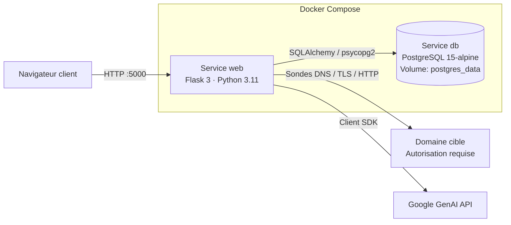

# SecuScope

> Plateforme d'audit de sécurité web : fingerprinting Edge/WAF (passif et actif léger), analyse heuristique SSL/DNS, audit des en-têtes HTTP de sécurité, notation algorithmique et génération de rapports de risque assistée par LLM.


---

## Table des matières

1. [Description & Périmètre](#1-description--périmètre)
2. [Avertissement légal & consentement](#2-avertissement-légal--consentement)
3. [Architecture & Stack technique](#3-architecture--stack-technique)
4. [Installation & Usage](#4-installation--usage)
5. [Configuration](#5-configuration)
6. [Structure du dépôt](#6-structure-du-dépôt)
7. [Limites connues & durcissement production](#7-limites-connues--durcissement-production)
8. [Roadmap & Benchmarks](#8-roadmap--benchmarks)
9. [Contribuer](#9-contribuer)
10. [Licence](#10-licence)

---

## 1. Description & Périmètre

**SecuScope est un outil d'observation et de pré-qualification défensive, pas un scanner de vulnérabilités intrusif.**

Il identifie l'infrastructure de bordure d'une application (CDN, WAF, reverse proxy, hébergeur) et évalue sa posture défensive visible depuis la périphérie, à partir d'indicateurs exposés publiquement : handshake TLS, enregistrements DNS (A, PTR, CNAME, NS), en-têtes de réponse HTTP et attributs de cookies.

### Capacités fonctionnelles

| Capacité | Implémentation |
|---|---|
| **Fingerprinting Edge/WAF en cascade** | Trois niveaux successifs : (1) `wafw00f`, (2) signatures passives multi-signaux (en-têtes, cookies, corps de réponse, CNAME/NS), (3) sonde active légère (une requête `GET /?id=1' OR '1'='1` observant uniquement le code de statut retourné — 403/406/429/501 — pour confirmer une interception périmétrique). |
| **Inférence d'infrastructure** | Corrélation entre autorité de certification TLS et enregistrements DNS pour identifier la plateforme (Cloudflare, Akamai, AWS CloudFront, Azure Front Door, Fastly, Imperva, Google Edge, etc. — 15 architectures couvertes). |
| **Analyse heuristique SSL/TLS** | Vérification du port 443, validation de la chaîne X.509, contrôle de la date d'expiration, identification de l'autorité de confiance, gestion des architectures fortement filtrées. |
| **Audit des en-têtes & cookies** | Contrôle de conformité de 6 en-têtes de sécurité (HSTS, CSP, X-Frame-Options, X-Content-Type-Options, Referrer-Policy, Permissions-Policy), vérification de la redirection HTTPS forcée, contrôle du flag `Secure` sur les cookies. |
| **Notation heuristique normalisée** | Score 0–100 et grade A–F : base de 50 points, addition/déduction par signal (ex. +20 SSL valide, +15 WAF identifié, +5 par en-tête conforme), mise à zéro immédiate en cas de défaillance critique (repli HTTP en clair). |
| **Rapport structuré par LLM** | Agrégation des signaux transmis à l'API Google GenAI, réponse contrainte au format JSON (résumé directionnel, axes techniques prioritaires, score d'exposition par vecteur). |

### Périmètre d'exclusion

- Aucune exploitation de vulnérabilité applicative, aucune exécution de charge utile, aucune exfiltration de données.
- Aucun fuzzing de chemins, aucune tentative de force brute, aucune génération de trafic de déni de service.
- Aucun mécanisme de contournement ou d'évasion de WAF.
- La seule composante active du moteur est une requête HTTP GET unique visant à confirmer une interception périmétrique (403/406/429/501) — volume d'émission réseau réduit au strict nécessaire.

---

## 2. Avertissement légal & consentement

> ** N'utilisez SecuScope que sur des systèmes dont vous êtes propriétaire, ou pour lesquels vous disposez d'une autorisation écrite, explicite et préalable de leur responsable.**

- Le formulaire de soumission impose la validation d'une case d'engagement (`legal_consent`) attestant du mandat légal, avant tout déclenchement d'analyse.
- Un contrôle anti-SSRF (`is_safe_domain`, via `ipaddress.is_private`) rejette systématiquement les plages d'adresses privées, les interfaces locales (`localhost`, `127.0.0.1`) et les adresses réservées.
- Conformément aux articles 323-1 et suivants du Code pénal, l'accès ou le maintien non autorisé dans un système de traitement automatisé de données constitue une infraction pénale (des dispositions équivalentes existent dans la plupart des juridictions).
- Toute requête émise — y compris la sonde active décrite en §1 — reste identifiable dans les journaux du système distant et peut déclencher des alertes SOC.

---

## 3. Architecture & Stack technique

### 3.1 Vue d'ensemble des services



| Service | Image / build | Rôle | Port |
|---|---|---|---|
| `web` | Build local (`Dockerfile`, base `python:3.11-slim`) | Application Flask, moteur d'analyse, dashboard | `5000` |
| `db` | `postgres:15-alpine` | Persistance des audits (volume `postgres_data`) | interne uniquement |

### 3.2 Pipeline d'exécution

```text
[Requête POST /scan]
       │
       ▼
1. Validation d'accès et syntaxique (app/routes.py)
   ├─ Contrôle de la présence de la clé API et du modèle en session
   ├─ Vérification de l'engagement de consentement légal (legal_consent)
   └─ Validation syntaxique du domaine (validators.domain)
       │
       ▼
2. Résolution DNS et contrôle SSRF (app/services/scanner.py)
   ├─ Collecte des enregistrements A, PTR, CNAME, NS (dnspython)
   ├─ Rejet immédiat si résolution sur IP privée (is_safe_domain)
   └─ Rejet si NXDOMAIN
       │
       ▼
3. Traitement concurrent (ThreadPoolExecutor, max_workers=2)
   ├─ get_ssl_info() : handshake TCP/443, lecture X.509, émetteur + échéance
   └─ get_http_info() : requêtes curl_cffi (empreinte Chrome 120)
       │
       ▼
4. Fingerprinting WAF, Edge et en-têtes
   ├─ Vérification du forçage HTTPS (rejet si redirection HTTP en clair)
   ├─ Cascade WAF : (1) wafw00f → (2) signatures passives → (3) sonde active légère
   ├─ Identification de la stack logicielle et audit des en-têtes de protection
   └─ Inférence d'infrastructure (autorités TLS + zones DNS)
       │
       ▼
5. Notation algorithmique (app/services/scoring.py)
   ├─ Base de 50 points, sommation selon score_details
   └─ Bornage [0, 100] + attribution du grade (A à F)
       │
       ▼
6. Rapport structuré par LLM (app/services/ai.py)
   ├─ Appel à l'API Google GenAI (retry sur erreur 503)
   └─ Réponse JSON strict, sans balises externes
       │
       ▼
7. Sauvegarde et restitution
   ├─ Insertion en base PostgreSQL (table audits, liée à session_id)
   └─ Redirection vers /dashboard/<audit_id>
```

### 3.3 Organisation interne du package `app/`

| Fichier | Rôle |
|---|---|
| `app/__init__.py` | Application factory (`create_app`), initialisation SQLAlchemy, activation globale de `CSRFProtect`, enregistrement du blueprint. |
| `app/routes.py` | `GET/POST /` : réception et stockage en session de la clé API Google GenAI et du modèle cible · `GET/POST /scan` : validation, exécution du pipeline, calcul du score, appel IA, insertion en base · `GET /dashboard/<int:audit_id>` : affichage des résultats avec contrôle d'appartenance par `session_id` · `GET /logout` : réinitialisation de session. |
| `app/models.py` | Modèle `Audit` (SQLAlchemy) : `id`, `domain`, `timestamp` (UTC), `scan_data` (JSON brut : SSL, WAF, IP, serveurs, en-têtes, cookies), `ai_report` (JSON structuré), `score` (A–F), `numeric_score` (0–100), `session_id` (UUID). |
| `app/services/scanner.py` | Moteur d'acquisition réseau (`curl_cffi`, `socket`, `ssl`). Détection des architectures fortement filtrées (« Forteresse ») et neutralisation du score global en cas d'anomalie majeure. |
| `app/services/signature.py` | `WAF_SIGNATURES` (15 architectures : Cloudflare, Akamai, Fastly, AWS CloudFront, Imperva, Azure Front Door, F5 BIG-IP, Sucuri, ModSecurity, Google Edge, etc.) · `INFRA_SIGNATURES` (corrélation CA TLS / zones DNS) · `TECH_SIGNATURES` (Nginx, Apache, LiteSpeed, Caddy, IIS, PHP, ASP.NET, Java, Node.js, Python) · `SECURITY_HEADERS` (référentiel des 6 en-têtes audités). |
| `app/services/scoring.py` | Fonction déterministe d'évaluation à partir de `score_details`. |
| `app/services/ai.py` | Client `google-genai` ; contraint le modèle à une sortie JSON exclusive. |
| `app/static/` | Ressources statiques (CSS/JS). |
| `app/templates/` | Vues Jinja2 (authentification, scan, dashboard). |

### 3.4 Format du rapport LLM

```json
{
  "executive": "Synthèse directionnelle du niveau d'exposition du domaine.",
  "technical": [
    "Recommandation technique 1 (ex. restructuration de la politique CSP)",
    "Recommandation technique 2 (ex. application de HSTS includeSubDomains)",
    "Recommandation technique 3 (ex. flag Secure sur l'ensemble des cookies)",
    "Recommandation technique 4 (ex. suppression des en-têtes de version serveur)"
  ],
  "risks": {
    "mitm": 85,
    "xss": 30,
    "clickjacking": 95,
    "sniffing": 100,
    "waf": 80
  }
}
```

### 3.5 Stack technique

| Couche | Technologie | Version |
|---|---|---|
| Langage | Python | 3.11 (`python:3.11-slim`) |
| Framework web | Flask | 3.0.0 |
| ORM | Flask-SQLAlchemy | 3.1.1 |
| Formulaires / CSRF | Flask-WTF | 1.2.1 |
| Base de données | PostgreSQL (`psycopg2-binary` 2.9.9) | 15 (alpine) |
| Configuration | python-dotenv | 1.0.0 |
| Client HTTP | requests / curl_cffi | 2.31.0 / ≥ 0.5.10 |
| DNS | dnspython | 2.4.2 |
| Fingerprinting WAF | wafw00f | 2.2.0 |
| Validation | validators / pydantic | 0.22.0 / 2.5.2 |
| Rotation User-Agent | fake-useragent | 1.5.1 |
| LLM | google-genai | ≥ 0.3.0 |
| Serveur WSGI (dépendance présente) | gunicorn | 21.2.0 |
| Conteneurisation | Docker, Docker Compose | — |

---

## 4. Installation & Usage

### Prérequis

- Docker Engine ≥ 20.10 et Docker Compose v2
- Une clé d'API Google GenAI valide
- Le port TCP `5000` disponible sur la machine hôte

### Déploiement initial

```bash
# 1. Récupération du code source
git clone https://github.com/WeKup/SecuScope.git
cd SecuScope

# 2. Préparation de l'environnement
cp .env.example .env
python3 -c "import secrets; print('SECRET_KEY=' + secrets.token_hex(32))" >> .env

# 3. Construction et démarrage des conteneurs
docker compose up --build -d
```

L'application est accessible sur **http://localhost:5000**. La clé d'API Google GenAI et le modèle cible se saisissent ensuite dans l'interface (session), pas dans `.env` (voir §5).

### Commandes d'administration

```bash
# Consulter les journaux du service web
docker compose logs -f web

# Ouvrir un shell dans le conteneur applicatif
docker compose exec web bash

# Se connecter à PostgreSQL
docker compose exec db psql -U secuuser -d secudb

# Arrêter la stack (données conservées)
docker compose down

# Arrêter et purger le volume de données
docker compose down -v
```

> Les identifiants PostgreSQL du `docker-compose.yml` (`secuuser` / `secupass` / `secudb`) sont des valeurs de **développement local**, à ne jamais réutiliser telles quelles hors de votre machine.

### Utilisation

1. Ouvrir `http://localhost:5000`, renseigner la clé d'API Google GenAI et le modèle souhaité.
2. Sur `/scan`, saisir le domaine cible, cocher l'engagement de consentement légal, lancer l'audit.
3. Consulter le résultat sur `/dashboard/<audit_id>` : score/grade, détail des signaux (SSL, WAF, en-têtes) et rapport LLM.

---

## 5. Configuration

Variables définies dans `.env.example` :

| Variable | Usage | Portée |
|---|---|---|
| `FLASK_APP` | Point d'entrée (`run.py`) | `.env` local |
| `FLASK_ENV` | Mode du framework (`development` / `production`) | `.env` local |
| `SECRET_KEY` | Chiffrement des cookies de session et jetons CSRF — à générer, jamais commitée | `.env` local |
| `DATABASE_URL` | Chaîne de connexion PostgreSQL — **surchargée** par `docker-compose.yml` sous Compose | `.env` local / conteneur |

**La clé d'API Google GenAI n'est pas stockée dans `.env`** : elle est transmise via l'interface au moment de l'authentification et conservée en session, ce qui limite le risque d'exposition dans des fichiers de configuration partagés.

`.env` est ignoré par Git (`.gitignore`). Ne commitez jamais de secrets.

---

## 6. Structure du dépôt

```text
SecuScope/
├── app/
│   ├── __init__.py          # Application factory, SQLAlchemy, CSRFProtect
│   ├── models.py            # Modèle Audit (SQLAlchemy)
│   ├── routes.py            # Routes HTTP et contrôle d'accès
│   ├── services/
│   │   ├── ai.py            # Client Google GenAI, contrainte de sortie JSON
│   │   ├── scanner.py       # Moteur réseau (DNS, SSL, HTTP)
│   │   ├── scoring.py       # Algorithme de notation
│   │   └── signature.py     # Signatures WAF, Edge et stacks logicielles
│   ├── static/               # CSS / JS
│   └── templates/            # Vues Jinja2 (auth, scan, dashboard)
├── .env.example              # Gabarit de configuration
├── .gitignore
├── docker-compose.yml        # Orchestration web + db
├── Dockerfile                # Image applicative (python:3.11-slim)
├── LICENSE                   # MIT
├── requirements.txt          # Dépendances Python épinglées
└── run.py                    # Entrée : create_app, db.create_all, app.run
```

---

## 7. Limites connues & durcissement production

| Domaine | État actuel | Durcissement recommandé |
|---|---|---|
| Serveur d'application | `python run.py`, `debug=True` | `gunicorn -w 4 -b 0.0.0.0:5000 run:app` (déjà dans `requirements.txt`), `debug=False` |
| Schéma de données | `db.create_all()` à chaque démarrage | Migrations tracées (Alembic / Flask-Migrate) |
| Identifiants | En clair dans `docker-compose.yml` | Docker Secrets ou coffre-fort |
| Privilèges du conteneur | root par défaut | `USER appuser` dédié et non privilégié |
| Démarrage de la base | `depends_on` sans vérification de disponibilité | `healthcheck` + `condition: service_healthy` |
| Limitation de débit | Absente | `Flask-Limiter` (+ Redis) |
| `FLASK_ENV` | Variable dépréciée depuis Flask 2.3 | `--debug` / `FLASK_DEBUG` |
| Clé `version` du Compose | `version: '3.8'` obsolète en Compose v2 | À retirer |
| Traitement réseau | Synchrone via `ThreadPoolExecutor` in-process | Décharger sur file asynchrone (Celery/Redis) pour la montée en charge |

---

## 8. Roadmap & Benchmarks

> **Statut : aucune mesure n'a encore été réalisée.** Les tableaux ci-dessous sont des gabarits vides — les valeurs `—` sont à remplacer par des résultats réels, jamais par des données hypothétiques.

### 8.1 Précision du fingerprinting WAF/CDN

**Protocole cible** : échantillon d'au moins 100 domaines audités sous autorisation, vérité terrain établie manuellement via la console d'administration de chaque architecture. Précision = TP/(TP+FP), Rappel = TP/(TP+FN), F1 = 2·P·R/(P+R).

**Matrice de confusion (gabarit)** — lignes : vérité terrain ; colonnes : détection SecuScope.

| Vérité \ Détecté | Akamai | Cloudflare | AWS CloudFront/WAF | Autre | Non détecté |
|---|:---:|:---:|:---:|:---:|:---:|
| **Akamai** | — | — | — | — | — |
| **Cloudflare** | — | — | — | — | — |
| **AWS CloudFront/WAF** | — | — | — | — | — |
| **Autre** | — | — | — | — | — |
| **Non détecté** | — | — | — | — | — |

**Indicateurs par classe (gabarit)**

| Classe | Précision | Rappel | F1 | Support (n) |
|---|:---:|:---:|:---:|:---:|
| Akamai | — | — | — | — |
| Cloudflare | — | — | — | — |
| AWS | — | — | — | — |
| Autre | — | — | — | — |
| Non détecté | — | — | — | — |
| **Moyenne globale** | — | — | — | — |

### 8.2 Latence par composant

| Phase | p50 (ms) | p95 (ms) | p99 (ms) | N |
|---|:---:|:---:|:---:|:---:|
| Résolution DNS + contrôle SSRF | — | — | — | — |
| Handshake TLS + inspection certificat | — | — | — | — |
| Analyse HTTP + détection d'infrastructure | — | — | — | — |
| Corrélation + appel LLM | — | — | — | — |
| **Total bout en bout** | — | — | — | — |

### 8.3 État d'avancement

- [x] Moteur de signatures passives (DNS, en-têtes, cookies, corps)
- [x] Protection anti-SSRF sur les plages d'adresses réservées et privées
- [x] Détection des configurations fortement filtrées avec gestion des faux positifs
- [x] Intégration Google GenAI avec sortie JSON contrainte
- [ ] Déchargement du traitement réseau sur file asynchrone (Celery/Redis)
- [ ] Export des rapports d'audit en PDF/JSON téléchargeable
- [ ] Suite de tests unitaires et d'intégration avec interception réseau
- [ ] Harnais de benchmark reproductible alimentant les tableaux du §8.1/§8.2
- [ ] Automatisation des campagnes de précision en CI

---

## 9. Contribuer

- Toute modification de `app/services/signature.py` doit s'appuyer sur des captures de flux HTTP réelles et des validations documentées.
- Toute nouvelle sonde active doit rester strictement non destructive et limitée aux cas d'échec des méthodes passives.
- Le code respecte PEP 8 et ne doit jamais affaiblir le contrôle anti-SSRF.
- Les vulnérabilités de sécurité se signalent via l'onglet *Security* du dépôt GitHub, pas via une issue publique.

---

## 10. Licence

Distribué sous licence **MIT**. Voir le fichier [`LICENSE`](./LICENSE).

Copyright (c) 2026 Maxime
